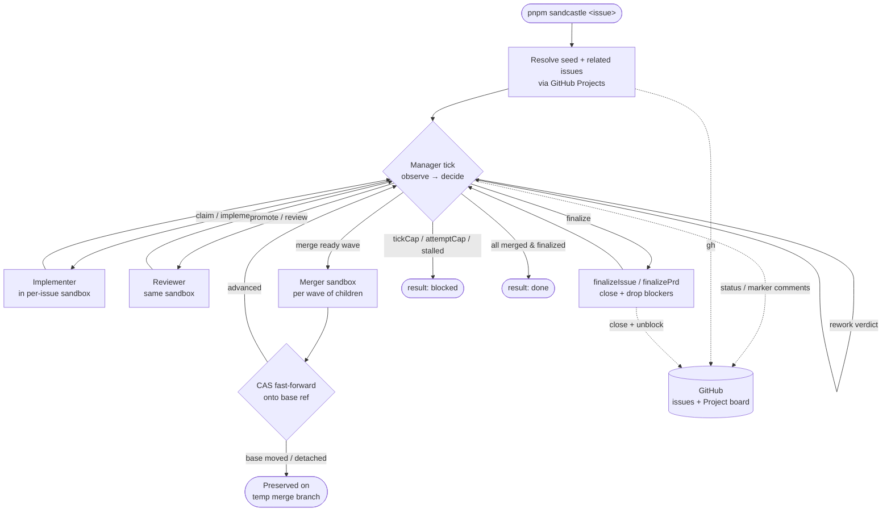

# sandcastling

A testbed for automating GitHub issues with [`@ai-hero/sandcastle`](https://github.com/mattpocock/sandcastle).

`sandcastle` runs a coding agent (here: Claude Code) inside a disposable
Docker sandbox against a git worktree of this repo. `sandcastling` wraps
that with an orchestrator that takes a GitHub issue (or PRD with child
issues), drives implement → review → merge through one container per
issue, and fast-forwards the result onto your base branch — without ever
touching the host filesystem or shared branches.

---

## How it works



- **One container per issue.** The implementer and reviewer share a
  sandbox; on approval the container is released. Merge runs in its own
  short-lived sandbox.
- **The host branch never moves until the merger succeeds.** Landing is a
  compare-and-set fast-forward against the ref you started on; if it
  moved underneath, the merger output is preserved on a temp branch for
  manual recovery.
- **The orchestrator owns all GitHub state** — status moves, marker
  comments, closing issues, dropping blocking edges. Stages only commit
  code.

---

## Quick start

### Prerequisites

- Node.js ≥ 22 (see `.nvmrc`)
- pnpm 10.31.0 (auto-activated via Corepack)
- Docker running locally
- `gh` authenticated against the target repo
- An Anthropic API key

### Setup

```bash
pnpm install
cp .sandcastle/.env.example .sandcastle/.env
# then edit .sandcastle/.env and set ANTHROPIC_API_KEY=sk-ant-...
pnpm build:image      # builds the sandcastle:latest Docker image
```

### Run against an issue

```bash
pnpm sandcastle 42    # seed = issue #42 (single issue or a PRD)
```

The orchestrator will:

1. Resolve the seed and any child issues from the GitHub Project board.
2. Spin up one sandbox per issue against a fresh worktree on its branch.
3. Drive implement → review → (rework or) merge until done, capped by
   `tickCap` and `attemptCap`.
4. Fast-forward your base ref to the merger result and release the
   sandboxes.

A per-run transcript lands in `.sandcastle/logs/`.

---

## What's inside

```
.sandcastle/
├── main.ts                  # entrypoint: pnpm sandcastle <issue>
├── Dockerfile               # sandbox image (node 22 + git + Claude Code CLI + pnpm)
├── prompts/
│   ├── system.md            # base system prompt for every stage
│   ├── implement.md         # implementer task prompt
│   ├── review.md            # reviewer task prompt
│   └── merge.md             # merger task prompt
├── lib/
│   ├── orchestrator.ts      # wires gh / git / sandbox / Project board
│   ├── manager/             # pure observe-decide-act workflow loop
│   ├── agent.ts stages.ts   # implement / review / merge stage runners
│   ├── docker.ts chown.ts   # custom bind-mount provider (UID 1000 sandbox)
│   ├── git.ts project.ts    # CAS fast-forward, related-issue lookup
│   └── volumes.ts           # warm pnpm-store / node_modules volumes
├── .env.example             # ANTHROPIC_API_KEY lives here
├── logs/                    # per-run transcripts (gitignored)
└── worktrees/               # ephemeral git worktrees per run (gitignored)
```

The host project itself is intentionally minimal: TypeScript + Biome,
`chalk` so the agent has something to import, pnpm pinned via
`packageManager` in `package.json`.

---

## Useful scripts

| Command            | Purpose                                                   |
| ------------------ | --------------------------------------------------------- |
| `pnpm sandcastle N`| Run the orchestrator against issue / PRD `#N`             |
| `pnpm build:image` | (Re)build the sandbox Docker image                        |
| `pnpm clean`       | Drop the persistent `node_modules` / pnpm-store volumes   |
| `pnpm verify`      | `tsc --noEmit` + Biome `check` + `node --test`            |
| `pnpm lint` / `format` | Biome lint / format                                   |
| `pnpm test`        | Run the workflow / adapter unit tests                     |

---

## Tuning

- **Model, caps, transcript sink** — pass options to `runOrchestrator` in
  `.sandcastle/main.ts` (`tickCap`, `attemptCap`, `model`, `transcript`).
- **Stage behavior** — edit the relevant prompt under
  `.sandcastle/prompts/`. Behavior changes belong there, not in adapter
  code.
- **Workflow logic** — `.sandcastle/lib/manager/` is a pure
  observe-decide-act loop. Add phases / actions there; keep adapters
  (`gh`, `git`, Docker, Projects) in `orchestrator.ts` and friends.

---

## Known limitations

- Auth is API-key only. Subscription-based auth via `CLAUDE_CODE_OAUTH_TOKEN`
  is tracked upstream in
  [mattpocock/sandcastle#191](https://github.com/mattpocock/sandcastle/issues/191).
- The sandbox runs as UID 1000 (`agent`); the custom provider in
  `.sandcastle/sandboxes/docker/` exists to keep file ownership sane on
  bind mounts — see the design notes in `docker.ts` and `chown.ts` before
  changing it.
- One concurrent sandbox container per issue. Cross-issue parallelism is
  bounded by `tickCap` and the manager, not by Docker.

---

## For agents

Durable instructions for any agent (host or sandboxed) working in this
repo live in [`CLAUDE.md`](./CLAUDE.md). Stage-specific task prompts live
under `.sandcastle/prompts/`.

---

## License

Private / unpublished. Do not redistribute.
